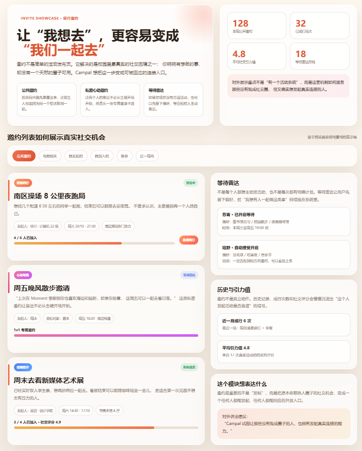
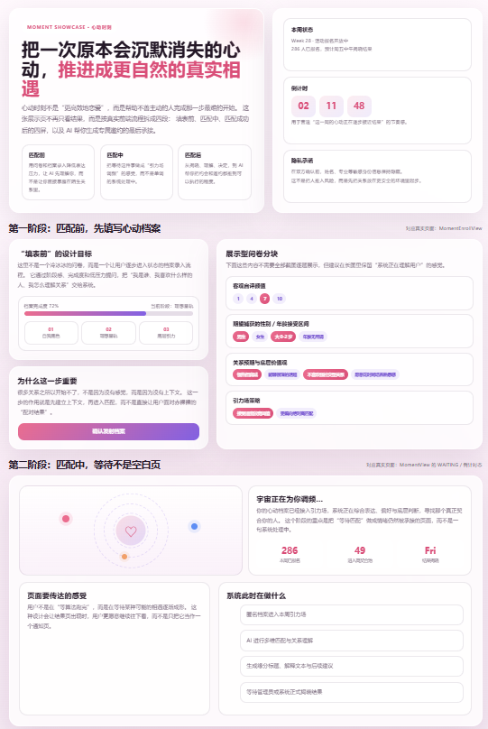
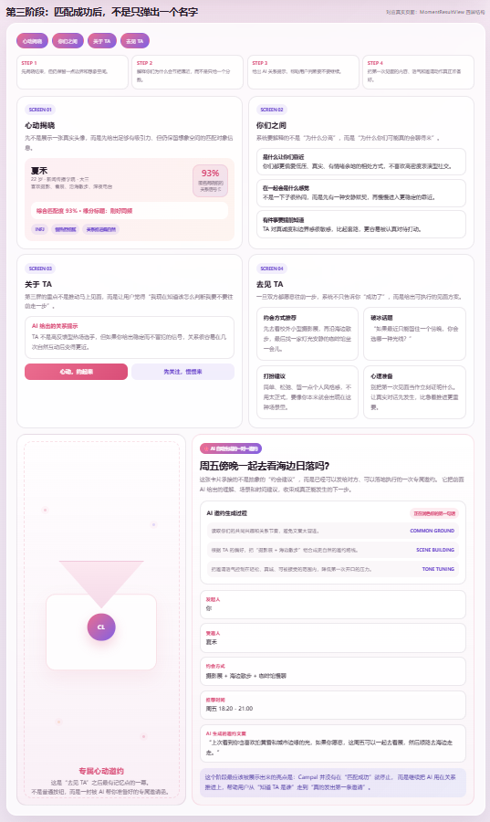

# <div align="center">Campal</div>

<div align="center">
  
  <h3>用虚拟 AI 推动真实社交</h3>
  <p>一个围绕校园场景设计的 AI 社交产品原型，重点不是延长线上停留，而是帮助年轻人更自然地走向真实连接。</p>
</div>

<div align="center">
  <a href="http://campal.social"></a>
  <a href="docs/vision.md"></a>
  <a href="README.en.md"></a>
</div>

<br />

> Campal 想解决的不是“线上陪伴”，而是“真实连接的起步门槛”。

很多学生不是不想社交，而是卡在第一步：

- 想出去玩，却找不到能一起去的人
- 对某个人有好感，却不知道怎么开始第一句话
- 有表达欲、有情绪、有观点，却缺少一个能形成共鸣的公共空间

我们希望 AI 在这里扮演的角色，不是替代关系，而是帮助关系发生。完整愿景见 [docs/vision.md](docs/vision.md)。

## 项目概览

<table>
  <tr>
    <td width="62%" valign="top">
      <strong>公开预览</strong><br />
      <a href="http://campal.social">http://campal.social</a><br /><br />
      线上站点可供外部预览，但由于校园身份与注册限制，非目标用户通常无法完整进入核心功能流。<br />
      因此这个 README 不只介绍功能，还会把产品理念、模块设计与关键界面一起展示出来。
    </td>
    <td width="38%" valign="top">
      <strong>项目定位</strong><br />
      AI 驱动的校园社交产品原型<br /><br />
      <strong>展示重点</strong><br />
      产品命题、关系机制、交互设计、真实连接路径
    </td>
  </tr>
</table>

## 我们想做什么

<table>
  <tr>
    <td width="33%" valign="top">
      <strong>不是沉迷线上</strong><br />
      我们不想把 Campal 做成一个让人无限刷、无限聊的社交容器。
    </td>
    <td width="33%" valign="top">
      <strong>而是推动起步</strong><br />
      我们更关心怎么把“想认识”“想靠近”“想一起做点什么”真正推进到现实里。
    </td>
    <td width="33%" valign="top">
      <strong>虚拟是桥</strong><br />
      AI、内容流、画像、匹配都只是桥，真实连接才是目的地。
    </td>
  </tr>
</table>

## 产品界面

<p>由于线上完整体验对身份有限制，这里除了在线预览，也保留了两组可以直接打开的静态展示页，方便外部访问者快速理解核心体验。</p>

<table>
  <tr>
    <td width="50%" valign="top">
      <strong>邀约展示页</strong><br />
      <a href="docs/showcase/invite-showcase.html">docs/showcase/invite-showcase.html</a><br />
      展示公共邀约、私密邀约、等待雷达和历史引力值，重点体现“没有现成圈子的人，也能主动发起连接”。
    </td>
    <td width="50%" valign="top">
      <strong>心动时刻展示页</strong><br />
      <a href="docs/showcase/moment-showcase.html">docs/showcase/moment-showcase.html</a><br />
      展示报名页、匹配等待、结果揭晓四屏、AI 邀约生成与专属信封，重点体现“AI 帮用户跨过第一步”。
    </td>
  </tr>
</table>

<table>
  <tr>
    <td width="50%" align="center" valign="top">
      
      <br />
      <strong>校园欢迎页</strong><br />
      用学校氛围、真实场景和轻叙事感，把产品从“工具”拉回“校园社交现场”。
    </td>
    <td width="50%" align="center" valign="top">
      
      <br />
      <strong>关系发生的场景感</strong><br />
      Campal 希望用户进入时先感受到“校园里真实的人与场”，而不是冷冰冰的功能入口。
    </td>
  </tr>
</table>

<table>
  <tr>
    <td width="14%" align="center"></td>
    <td width="14%" align="center"></td>
    <td width="14%" align="center"></td>
    <td width="14%" align="center"></td>
    <td width="14%" align="center"></td>
    <td width="14%" align="center"></td>
    <td width="14%" align="center"></td>
  </tr>
</table>

<p align="center">
  <strong>AI 头像工作室示例</strong><br />
  这类能力不是为了制造虚拟替身，而是帮助用户更轻松地完成表达、展示风格，并进入社交语境。
</p>

## 核心模块

<table>
  <tr>
    <td width="50%" valign="top">
      <h3>1. 邀约</h3>
      <strong>它解决的问题</strong><br />
      我想做点什么，但不知道找谁一起。<br /><br />
      <strong>它最重要的设计</strong><br />
      不是“发活动”，而是把“没有现成圈子”这件事，变成一个可以被快速回应的开放社交入口。<br /><br />
      <strong>重点机制</strong><br />
      公共邀约流、私密心动邀约、等待雷达、历史记录、社交引力值<br /><br />
      <strong>对外展示亮点</strong><br />
      Campal 让没有现成社交圈的人，也能主动发起真实连接。
    </td>
    <td width="50%" valign="top">
      <h3>2. 心动时刻</h3>
      <strong>它解决的问题</strong><br />
      我注意到了某个人，但不知道怎么靠近。<br /><br />
      <strong>它最重要的设计</strong><br />
      不是“配对成功率”，而是通过匿名报名、AI 辅助匹配、缘分解读、破冰建议和约会准备，把本来会沉默消失的心动推进成更自然、更安全的现实相遇。<br /><br />
      <strong>重点机制</strong><br />
      周期性报名活动、结果揭晓四屏结构、关系理解、去见 TA 的约会建议与协商入口<br /><br />
      <strong>对外展示亮点</strong><br />
      AI 不替用户做决定，而是帮助用户更自然地迈出第一步。
    </td>
  </tr>
</table>

## 关键展示图

<table>
  <tr>
    <td width="50%" align="center" valign="top">
      
      <br />
      <strong>邀约模块</strong><br />
      从公共邀约到私密邀约，再到等待反馈与历史引力值，Campal 把“发起一次真实见面”设计成可被低压力完成的动作。
    </td>
    <td width="50%" align="center" valign="top">
      
      <br />
      <strong>心动时刻 · 匹配流程</strong><br />
      从报名填写、等待调频到结果揭晓，重点展示产品如何先理解用户，再把心动安全地推进到下一步。
    </td>
  </tr>
</table>

<table>
  <tr>
    <td width="100%" align="center" valign="top">
      
      <br />
      <strong>心动时刻 · AI 邀约生成</strong><br />
      匹配成功并不是结束。Campal 继续用 AI 帮用户生成邀约语气、见面场景和专属信封，把“知道 TA 是谁”推进成“真的发出第一条邀请”。
    </td>
  </tr>
</table>

## 产品动线

<div align="center">
  <code>表达</code>
  →
  <code>发现</code>
  →
  <code>起步</code>
  →
  <code>过渡</code>
  →
  <code>真实连接</code>
</div>

<br />

Campal 的核心不是单点功能，而是一条关系推进路径：

1. 用户先通过资料、动态、兴趣与行为留下可被理解的痕迹。
2. 用户看到原本不会遇见的人、内容和活动。
3. 通过邀约、匹配和引导式交互降低社交起步成本。
4. 借助 AI 把线上理解转成线下行动建议。
5. 最终目标是发生真实互动，而不是提升应用停留时长。

## AI 在这里做什么

<table>
  <tr>
    <td width="25%" valign="top"><strong>理解表达</strong><br />帮助理解用户的兴趣、表达方式与画像线索。</td>
    <td width="25%" valign="top"><strong>降低门槛</strong><br />帮助用户更容易开始匹配、靠近和破冰。</td>
    <td width="25%" valign="top"><strong>提供上下文</strong><br />让初次接触少一点尴尬，多一点理由与场景。</td>
    <td width="25%" valign="top"><strong>推动线下</strong><br />让线上了解更自然地转向真实见面与互动。</td>
  </tr>
</table>

<p align="center"><strong>AI 的价值，不是让人更久停留在线上，而是让人更愿意走向彼此。</strong></p>

## 这个仓库代表什么

这个仓库更适合被理解为一个<strong>产品原型与开放展示项目</strong>。

它主要展示：

- 一个关于“AI 如何推动校园真实社交”的明确产品命题
- 围绕这个命题设计的一组功能机制与交互结构
- 一个已经落到后端、Web 与管理后台多个表面的可运行原型

## 仓库结构

```text
.
├── campus-love-backend/   # Spring Boot 后端
├── campus-love-frontend/  # Vue Web 前端
├── campus-love-admin/     # 管理后台
├── docs/                  # 对外公开文档与展示素材
└── README.md
```

## 技术实现

项目当前包含：

- Spring Boot
- Vue 3
- TypeScript
- MySQL
- Redis
- Flyway
- WebSocket

技术是实现方式，不是这个项目最想强调的部分。  
Campal 更重要的价值，在于它如何把产品理念、关系机制和 AI 能力组织成一个完整原型。

## 本地运行

运行说明请分别查看：

- [campus-love-backend](campus-love-backend/)
- [campus-love-frontend/README.md](campus-love-frontend/README.md)

本地运行前请自行准备环境变量和第三方服务配置，不要使用任何真实生产密钥或个人凭证。
